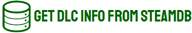

> Get Data from Steam / SteamDB / EpicDB (**ex Get DLC Info from SteamDB**) it's a userscript able to extract all the information of the **DLCs Games** from **[Steam](https://store.steampowered.com/)** / **[SteamDB](https://steamdb.info)** / **EpicDB** and are exported in various formats. **It also has small tools** :)

_[forum cs.rin.ru support](https://cs.rin.ru/forum/viewtopic.php?f=29&t=71837)_

## Donate

> **Protect development and free things -- because their survival is in our hands.**
>
> **You can donate by clicking on [paypal.me](https://www.paypal.me/sak32009a).**

## Documentation

### Installation

Make sure you have userscripts manager enabled in your browser:

- [Tampermonkey](https://tampermonkey.net/) _(CLOSED SOURCE)_
- [Violent Monkey](https://violentmonkey.github.io/) _(OPEN SOURCE)_
- ~~Greasemonkey~~ _!!NOT WORKING ANYMORE ON THIS USERSCRIPTS MANAGER!!_

Install a userscript directly from GitHub by clicking on the "RAW" button of the **[./sak32009-get-dlc-info-from-steamdb.user.js](./sak32009-get-dlc-info-from-steamdb.user.js)** page or click **[this](https://github.com/Sak32009/GetDLCInfoFromSteamDB/raw/master/sak32009-get-dlc-info-from-steamdb.user.js)**.

### Usage:

- **STEAMDB**

  - Go to [https://steamdb.info/app/570/dlc/](https://steamdb.info/app/570/dlc/) for example, click on the button at bottom-right screen, select format and click "Convert".

- **STEAMDB DEPOT to .sha1**

  - Go to [https://steamdb.info/depot/373303/](https://steamdb.info/depot/373303/) for example, click on "Click to view file hashes", click on the button at bottom-right screen and all entries are showed on textarea in .sha1 format.

- **STORE.STEAMPOWERED.COM**

  - Go to [https://store.steampowered.com/app/440900/Conan_Exiles/](https://store.steampowered.com/app/440900/Conan_Exiles/) for example, click on the button at bottom-right screen, select format and click "Convert".

- **EPICGAMES.COM**

  - Not ready.

### Features:

- do you need features?
- _click_ _click_
- i'm hungry.
- 🖤

## Updating

Userscripts are set up to automatically update. You can check for updates from within the menu of userscripts manager, or click on the install link again to get the update.

## License

- [The MIT License](./LICENSE)
